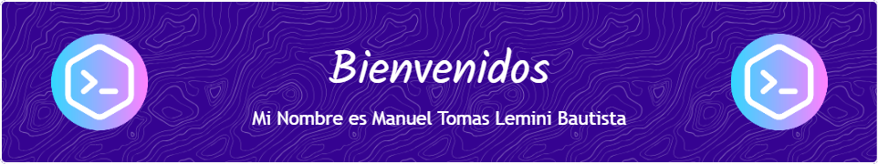

#### En este repositorio encontraras los proyectos en los que he estado trabajando  😄

  

### Sobre mi 🤔
###### Soy recien egresado de la carrera de Ing. Sistemas Computacionales en la Universidad Virtual del Estado de Guanajuato. Me considero una persona proactiva y con una gran capacidad para trabajar en equipo. Disfruto aprendiendo y aplicando nuevos conocimientos, lo que me permite adaptarme rápidamente a nuevas tecnologías y metodologías de trabajo. Además, poseo habilidades de comunicación efectiva, lo que facilita la colaboración y el entendimiento mutuo en un entorno de trabajo.

<!--
**Daskter912/Daskter912** is a ✨ _special_ ✨ repository because its `README.md` (this file) appears on your GitHub profile.

Here are some ideas to get you started:

- 🔭 I’m currently working on ...
- 🌱 I’m currently learning ...
- 👯 I’m looking to collaborate on ...
- 🤔 I’m looking for help with ...
- 💬 Ask me about ...
- 📫 How to reach me: ...
- 😄 Pronouns: ...
- ⚡ Fun fact: ...
-->
